# Agent Network

Each agent has a role, goals, tools, outputs, action logs, and decision reports. Agent decisions are written to the audit log.

Each principal agent also owns three read-only specialist subagents. The runtime selects only the
specialty justified by the request (one per parent by default), runs it on the parent's already
routed provider, unloads according to the existing model lifecycle, and gives its evidence back to
the parent. The parent remains accountable for the decision.

| Agent | Responsibility | Key Outputs |
| --- | --- | --- |
| Product Manager Agent | Product brief, success metrics, MVP boundaries, release risks | `product_brief.md`, `success_metrics.json` |
| Requirements Agent | Functional and non-functional requirements, clarification gating, user stories, acceptance criteria, edge cases | `requirements.md`, `acceptance_criteria.json`, `user_stories.json` |
| Planner Agent | Task decomposition, dependency graph, approval gates | `plan.json`, `timeline.md` |
| Solution Architect Agent | Architecture, domain model, contracts, module boundaries, API shape | `architecture.md`, `api_contract.yaml`, `domain_model.json` |
| Frontend Engineer Agent | Next.js, React, TypeScript, Tailwind, Zustand, React Query | `apps/web`, frontend tests |
| Backend Engineer Agent | FastAPI services, schemas, endpoints, integration tests | `apps/api`, backend tests |
| Database Engineer Agent | PostgreSQL schema, SQLAlchemy models, migrations | schema and migrations |
| DevOps Agent | Docker, lifecycle scripts, environment checks, deployment bundle | `docker-compose.yml`, PowerShell scripts |
| QA Agent | Unit, integration, and E2E quality gates | `test_report.json`, `qa_summary.md` |
| Security Agent | Code, dependency, endpoint, auth, RBAC, tenancy, billing, and secret review | `security_review.md`, `threat_model.md` |
| Documentation Agent | User, developer, architecture, troubleshooting, deployment, readiness, compliance, and integration docs | README and architecture docs |
| Code Review Agent | Diff review, maintainability, tests, standards, retry-failure summaries | `review.md`, findings |
| Release Agent | Release notes, deployment package, rollback notes, human escalation summary when needed | changelog and release bundle |
| Product Review Agent | Blocks weak product plans and requests refinement when buyer, value, pricing, or MVP are unclear | `product_review.json`, `required_refinements.md` |
| Meta Review Agent | Reviews all agent outputs against senior gates, scorecards, evidence, and release policy | `meta_review.json`, `senior_review_summary.md` |

## Agent Flow

```mermaid
flowchart LR
  User["User idea"] --> PM["Product Manager"]
  PM --> Req["Requirements"]
  Req --> ProductReview["Product Review"]
  ProductReview --> Arch["Solution Architect"]
  Arch --> Plan["Planner"]
  Plan --> DB["Database Engineer"]
  DB --> BE["Backend Engineer"]
  BE --> FE["Frontend Engineer"]
  FE --> QA["QA"]
  BE --> QA
  DB --> QA
  QA --> Sec["Security"]
  Sec --> Review["Code Review"]
  Review --> Docs["Documentation"]
  Docs --> Release["Release"]
  Release --> Approval["Approval Center"]
```

## Decision Reporting

The runtime sends each agent a role-specific prompt and records:

- agent name
- role
- decision text
- expected outputs
- provider and model
- context keys
- UTC timestamp
- delegated work-order IDs, specialist statuses, provider/model, confidence, and blockers

## Controlled Delegation

ANN's subagents are ephemeral analytical capabilities, not independent processes with authority.
Every delegation uses a typed `SubagentWorkOrder` containing its parent, objective, context
references, allowed files, allowed analytical tools, acceptance criteria, output schema, token
budget, timeout budget, depth, and lineage.

Safety invariants:

- One routed provider is used sequentially for the specialist and its parent.
- `active_models <= 1`, `parallel_llm_loads == 0`, and `SEQUENTIAL` remain mandatory.
- Subagents cannot run terminal commands, write files, apply patches, install packages, deploy, or
  delegate again.
- Absolute paths, traversal, and protected repository areas are rejected.
- Context is allowlisted, bounded, and redacts credential-like fields.
- Cycles, depth overflow, parent mismatch, undeclared tools, and budget overflow are blocked.
- Specialist failure is visible to the parent; it never becomes an implicit approval or success.
- The audit log records requested, started, completed, failed, and blocked delegation events.

The catalog and recent state are available through read-only endpoints:
`GET /api/subagents/catalog` and `GET /api/subagents/state`.

Specialist definitions may declare one of the sixty-eight engineering skill identifiers as an analytical
capability. This does not grant execution authority. The parent or user must still request the skill
through its typed API, satisfy persistent permissions, and complete Approval Center for every
terminal or mutating action. A subagent response can recommend a recipe but cannot authorize it.

The specialist catalog additionally covers agent/prompt evaluation, adversarial review, fuzz and
property testing, dependency remediation, refactor migrations, incident response, observability,
context quality, failure replay, privacy, event contracts, distributed resilience, synthetic data,
feature flags, memory profiling, cloud planning, accessibility execution,
dependency provisioning, semantic transformation/search, test generation,
mutation and visual regression, virtualization, consumer contracts,
infrastructure planning, schema drift, chaos, rollback, queue verification,
data quality, secret lifecycle, compatibility, and documentation drift.
Sixteen specialist families expose execution actions; each uses a fixed Docker
Compose recipe after single-use approval.

## Tool Boundaries

Agents do not directly write files or execute commands. They propose work through:

- Workspace manager
- Diff manager
- Approval center
- Docker sandbox manager
- Git manager
- Test runner workflow
- Audit logger
- Engineering skill runtime with closed, audited recipes

## Refinement and Correction

The network now includes a requirement-refinement engine that generates domain models, user stories, acceptance criteria, edge cases, API contracts, and test cases before implementation. Clarifying questions are reserved for genuinely ambiguous product category, billing, tenancy, or integration choices.

The old "infinite correction" concept is now named the configurable correction loop. It runs real build/test checks, requests Qwen unified diffs when deterministic fixes are insufficient, validates diffs before applying, retries with exponential backoff, records `.aen/retry-history.json`, and escalates to a human after `AEN_MAX_REPAIR_ATTEMPTS`.

## Senior Agent Contract

Each agent now carries an input schema, output schema, validation logic, quality rubric, failure modes, retry policy, and escalation rules. The runtime includes those contracts in the agent system prompt, and the Meta Review Agent checks consistency across outputs before release readiness.
