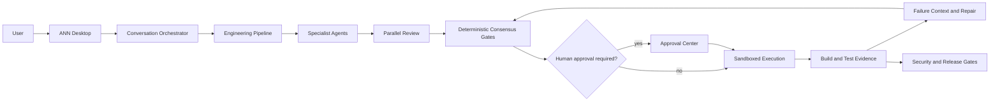

# ANN: Agentic Neural Network

**A local-first, approval-gated operating system for AI-assisted software engineering.**

ANN turns a natural-language product request into a traceable engineering run:
requirements, architecture, implementation proposals, tests, security review,
consensus, controlled patch application, verification, and release artifacts.
It runs on the user's machine, exposes its decisions, and keeps humans in
control of consequential actions.

> **Status: v1.0.1 stable source and unsigned Community release.** The source
> distribution, embedded runtime, GPU model lifecycle, isolated installer, and
> fresh-clone test matrix have been validated. The trusted-publisher Windows
> channel still requires a real Authenticode certificate and transferred
> evidence from a separate clean Windows 11 machine. ANN does not guarantee
> that one prompt will produce commercially successful software; generated
> code still requires qualified review.


## Why ANN Exists

Most coding assistants optimize a single model response. ANN treats software
delivery as a stateful system problem: multiple specialist roles exchange
structured artifacts, deterministic gates arbitrate disagreements, runtime
evidence outranks stylistic opinion, and unresolved ambiguity escalates to a
human rather than looping forever.

## What Works Today

- Native Windows desktop shell plus a local Next.js engineering workbench.
- Natural-language conversation handoff into a real multi-stage run.
- Product, requirements, planning, architecture, frontend, backend, database,
  DevOps, QA, security, documentation, review, meta-review, and release roles.
- Forty-five read-only specialist capabilities behind typed, bounded work
  orders. Principal agents delegate one focused analysis by default and remain
  accountable for every decision.
- Supervised and full-approval modes with persistent audit evidence.
- Proposed diffs before writes, patch quality gates, token confirmation, safe
  terminal allowlists, protected paths, and workspace traversal defenses.
- Sequential local model routing with at most one loaded model at a time.
- Desktop model registration for user-supplied GGUF files with native file
  selection, SHA-256 verification, license acknowledgement, D:/E: storage,
  and GPU-capable `llama_cpp` activation checks.
- Explicit recovery of interrupted post-generation runs from durable
  checkpoints; ANN never repeats host-affecting work merely because it
  restarted.
- Qwen 3 for conversation/product work, Qwen2.5-Coder for implementation, and
  DeepSeek-R1-Distill-Qwen for powerful review when locally configured.
- Failure Context Compiler for bounded, targeted repair payloads.
- Cross-domain root-cause isolation across source, tests, Docker, YAML, SQL,
  migrations, package metadata, environment contracts, and infrastructure.
- Test Validity Gate that can classify a failing assertion as suspect instead
  of blindly rewriting valid implementation code.
- Product Contract Arbitration with deterministic evidence priority and human
  escalation when the contract is ambiguous.
- Consensus policy that suppresses stylistic bikeshedding when functionally
  valid options are equivalent.
- Bounded autonomous correction, retry history, exponential backoff, safe
  rollback, and `FAILED_PERMANENTLY` escalation.
- Architecture entropy analysis to detect accumulated complexity and propose
  explicit refactoring work instead of endlessly adding local conditionals.
- One hundred twenty-six permission-scoped engineering skills and two hundred forty-five typed actions covering contracts,
  dependencies, observability, test validity, architecture fitness,
  backup/restore, performance, supply chain, provenance, deployment,
  integrations, UX, Git collaboration, web/package lookup, and specialist
  mobile, game, data, ML, infrastructure, desktop, localization, agent
  evaluation, adversarial review, fuzzing, replay, privacy, resilience,
  incident response, accessibility, dependency provisioning, semantic
  transformation/search, test generation, mutation and visual regression,
  service virtualization, consumer contracts, infrastructure planning,
  schema drift, chaos, rollback, queues, data quality, secret lifecycle,
  cross-platform compatibility, documentation drift, and controlled
  migration evidence, plus requirement traceability, Git history, database
  plans, stateful workflows, concurrency, reproducible builds, configuration
  parity, SLOs, journeys, upgrade/recovery drills, release channels,
  clean-machine evidence, signed vulnerability intelligence, policy as code,
  formal models, coverage-guided synthesis, architecture debt trends,
  archetype synthesis, behavioral oracles, dynamic authorization,
  checkpoint integrity, trajectory forensics, delegation optimization,
  cross-language semantic impact, flaky-test investigation, online migration
  rehearsals, local resource quotas, secure updates, installer VM evidence,
  model-runtime certification, API-abuse simulation, performance bisecting,
  asset provenance, invariant mining, AI governance evidence, language-server
  diagnostics, autonomous delivery benchmarks, runtime failure recovery,
  native/mobile evidence labs, LLM application security, executable privacy
  rights, cryptographic protocols, SDK conformance, capacity economics,
  cross-store consistency, product telemetry contracts, identity protocols,
  temporal and monetary invariants, offline synchronization, binary hardening,
  web protocols, search relevance, agent-tool contracts, messaging delivery,
  data residency, and assistive-technology evidence.
- Deterministic failure-to-skill planning feeds bounded diagnostic evidence
  back into correction attempts. Skill execution, command approval, and patch
  application remain separate existing gates.
- Project templates, Docker validation, health checks, security scans,
  documentation, packaging, and generated-project lifecycle artifacts.

## Architecture



Model execution is sequential by policy:

```text
load one model -> run one stage -> capture metrics -> unload -> verify zero loaded models
```

ANN does not bundle model weights. Operators provide local model files and
configure their paths explicitly.

## Safety Model

ANN separates language-model suggestions from authority:

1. Agents propose structured outputs and diffs.
2. Deterministic policy validates scope, paths, approvals, and runtime state.
3. Supervised mode pauses before writes, commands, installs, or deployment.
4. Execution is constrained to approved workspaces and allowlisted operations.
5. Every decision and retry produces auditable artifacts.
6. Ambiguous contracts, invalid tests, repeated failures, or unsafe paths stop
   the loop and require human review.

No autonomous system can make arbitrary generated code safe. Run ANN in a
disposable workspace, inspect patches, and perform independent security and
legal review before production use.

## Repository Layout

```text
agentic_network/   Core agents, gates, runtime, memory interfaces, and safety
apps/api/          FastAPI service
apps/web/          Next.js/React engineering workbench
apps/desktop/      Native desktop shell
packages/          Shared orchestration, sandbox, Git, logs, DB, and security
config/            Portable runtime and routing policy
installer/         Windows install, uninstall, signing, and validation scripts
scripts/           Setup, maintenance, release, and runtime utilities
tests/python/      Runtime, safety, orchestration, and desktop test suite
docs/              Architecture, skills, runtime, storage, and operations docs
```

Private model weights, adapters, datasets, conversations, memory, generated
projects, runtime databases, logs, and historical outputs are deliberately
excluded from the public repository.

## Requirements

- Windows 11
- PowerShell 5.1+
- Python 3.11+
- Node.js 22 LTS
- Git
- Docker Desktop for container-backed project validation
- NVIDIA GPU recommended for local inference
- User-supplied GGUF/Hugging Face models where applicable

WSL2 is supported for an external CUDA-enabled Python runtime. A configured
Windows runtime may also be used. Cloud APIs are optional, not required.

### Development and validation hardware

ANN `v1.0.1` was primarily developed and validated on this local workstation:

- AMD Ryzen 5 2600 processor;
- NVIDIA GeForce RTX 3060 Ti with 8 GB of VRAM;
- 32 GB of DDR4 system memory.

This is a reference configuration, not a formal minimum or recommended system
requirement. Performance and model capacity depend on quantization, context
size, enabled services, and the models supplied by the operator.

## Quick Start From Source

```powershell
git clone https://github.com/ThatYakuzaGuy/ANN.git D:\AgenticEngineeringNetwork
Set-Location D:\AgenticEngineeringNetwork
Copy-Item .env.example .env
.\setup.ps1
.\start.ps1
```

Open the packaged desktop shell when available, or use the local workbench at
`http://127.0.0.1:3000`. API health is exposed at
`http://127.0.0.1:8000/api/health`.

The portable runtime starts in safe mode. Open **Models**, choose **Add Model**,
select a local GGUF on D: or E:, acknowledge its license, and register it. ANN
verifies the file without loading it. **Enable Real Runtime** is available only
when the installed `llama_cpp` binding reports GPU offload support; model loads
remain sequential and require the existing runtime gates.

For the offline Windows installation flow, including an embedded runtime,
packaged Desktop, optional hash-verified local model pack, and post-install
verification, see [the installer guide](installer/README_INSTALLER.md).

Install the optional model support dependencies, then install the pinned
llama.cpp binding without its vulnerable optional disk-cache dependency:

```powershell
python -m pip install -e ".[local-models]"
python -m pip install --no-deps -r apps/api/requirements-llama-cpp.txt
python scripts/security/verify_llama_cpp_dependency_policy.py
```

ANN disables persistent llama.cpp disk caching. Local inference uses no prompt
cache by default; `LlamaRAMCache` remains available for trusted in-memory use.

## Development Verification

```powershell
python -m ruff check agentic_network packages tests/python scripts
python -m pytest tests/python -q
npm ci
npm --workspace apps/web run lint
npm --workspace apps/web run test
npm --workspace apps/web run build
```

The release process also verifies a fresh exported clone, scans for secrets,
rejects large model artifacts, and records SHA-256 hashes in a public release
manifest.

## Evidence and Documentation

- [Architecture](ARCHITECTURE.md)
- [Agent responsibilities](AGENTS.md)
- [Controlled subagents](docs/CONTROLLED_SUBAGENTS.md)
- [Engineering skills](docs/ENGINEERING_SKILLS.md)
- [Specialist skill safety and execution](docs/SPECIALIST_SKILLS.md)
- [Security policy](SECURITY.md)
- [Dependency security](docs/DEPENDENCY_SECURITY.md)
- [Known limitations](LIMITATIONS.md)
- [Public release process](docs/PUBLIC_RELEASE.md)
- [Model backend configuration](README_LOCAL_MODEL_BACKENDS.md)
- [Storage behavior](docs/STORAGE.md)
- [Contributing](CONTRIBUTING.md)

## Honest Limitations

- ANN does not guarantee a sellable product from one prompt.
- Local model quality, latency, and context capacity depend on hardware and the
  models supplied by the operator.
- Deep domain behavior, production operations, compliance, UX validation, and
  external accounts still require qualified humans.
- The current desktop distribution is unsigned unless the release maintainer
  supplies a trusted code-signing certificate; Windows may show SmartScreen.
- Some project types need additional artifact families and domain-specific
  tools beyond the current SaaS, API, and canvas-game foundations.
- Autonomy is intentionally bounded. “Infinite correction” would be unsafe and
  is implemented as a configurable retry loop with escalation.

## License

ANN source code is released under the [MIT License](LICENSE). Third-party
components remain under their respective licenses; see [ATTRIBUTIONS.md](ATTRIBUTIONS.md).
