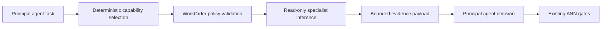

# Controlled Subagents

## Purpose

ANN gives every principal agent a small group of focused specialists without creating an
uncontrolled recursive swarm. Specialists improve evidence quality; the principal agent still owns
the decision and all existing approval, patch, terminal, security, consensus, and release gates.

## Runtime Flow



The specialist and parent share one routed provider session. Calls are sequential and guarded by a
runtime lock. ANN does not load a model per specialist group and does not permit concurrent local
LLM loads.

## Capability Groups

Each of the 15 principal agents owns three capabilities:

| Parent | Specialists |
| --- | --- |
| Product Manager | customer discovery, commercial strategy, activation journey |
| Requirements | functional contract, quality attributes, acceptance edge cases |
| Planner | dependency graph, delivery risk, approval boundaries |
| Solution Architect | domain boundaries, API contracts, runtime topology |
| Frontend Engineer | product UX, frontend state, accessibility/visual QA |
| Backend Engineer | application services, identity/authorization, integrations |
| Database Engineer | relational schema, migration safety, query/tenancy |
| DevOps | containers, CI/CD, reliability operations |
| QA | unit tests, integration tests, test validity |
| Security | threat model, access control, dependency/secrets |
| Documentation | user docs, developer docs, operations runbooks |
| Code Review | correctness, architecture entropy, contract alignment |
| Release | packaging, migrations/rollback, readiness evidence |
| Product Review | value, scope, launch readiness |
| Meta Review | cross-agent consistency, gate evidence, escalation quality |

## Work Order

`SubagentWorkOrder` records:

- work-order and task IDs
- parent agent and selected specialization
- narrow objective and acceptance criteria
- explicit context references and relative allowed files
- declared analytical tools
- output schema, token budget, timeout budget, depth, and lineage

Only named context references are compiled. Credential-like keys are redacted and total context is
bounded. Specialists do not read arbitrary files on their own.

## Safety

The scheduler blocks:

- parent/specialist mismatch
- unknown capabilities, cycles, and excess depth
- absolute paths, traversal, and protected paths
- undeclared or host-affecting tools
- parent/run, token, timeout, and context budget overflow

No subagent endpoint executes work directly. The public API is read-only:

- `GET /api/subagents/catalog`
- `GET /api/subagents/catalog?parent_agent=Backend%20Engineer%20Agent`
- `GET /api/subagents/state?run_id=<run-id>`

## Configuration

```dotenv
ANN_SUBAGENTS_ENABLED=true
ANN_SUBAGENT_MAX_PER_AGENT=1
ANN_SUBAGENT_MAX_PER_RUN=20
ANN_SUBAGENT_MAX_DEPTH=1
ANN_SUBAGENT_CONTEXT_CHARACTERS=12000
ANN_SUBAGENT_TOKEN_BUDGET=768
ANN_SUBAGENT_TIMEOUT_SECONDS=300
```

The defaults are tuned for an 8 GB GPU: one specialist per principal stage and no parallel model
loads. Increasing the per-agent value raises latency and should be benchmarked locally.

## Limitations

- Selection is deterministic keyword scoring, not an unconstrained model-created agent hierarchy.
- Timeout is a bounded work-order contract; native in-process inference cannot be force-killed safely
  without risking a loaded-model leak.
- A specialist response is advisory model output. Parent validation, executable tests, consensus,
  approvals, and human escalation remain necessary.
